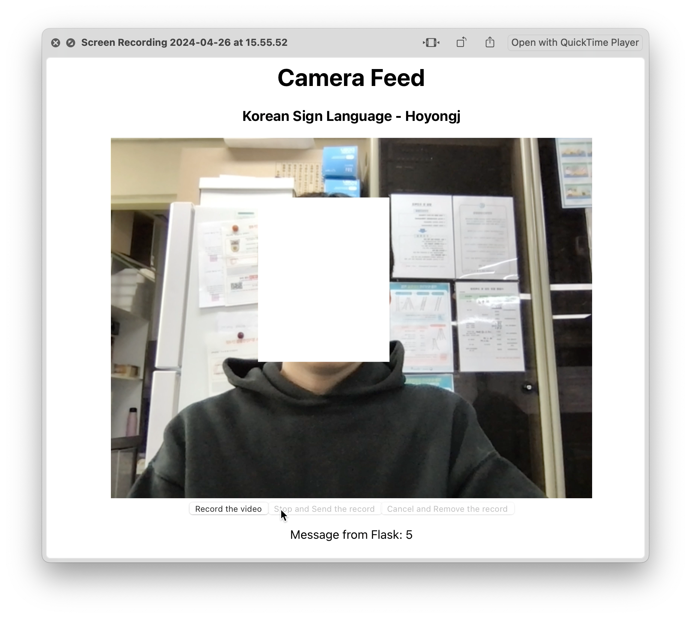

# sign-language-website-public

## Table of Contents
1. [Introduction](#1-introduction)
2. [How does the model work](#2-how-does-the-model-work)
2. [How To Run The Server](#3-how-to-run-the-server)
3. [Demonstration](#4-demonstration)


## 1. Introduction

I worked on **Korean Sign Language (KSL)** recognition project about for 4 months. As I plan to open the main repository later, I will give overall demonstation of my project in this repository.


## 2. How does the model work

First, I extracted landmark points from videos by using **Google - MediaPipe**.


(This is me.)


Then, by using **Long short-term memory (LSTM)** layers, I built neural network model.


(Images from Wikipedia)


## 3. How to run the server

Requirements: Docker (with compose)

Operating System may not matter.

```shell
#!/bin/bash
docker-compose up
```

(Note that, backend server may require time to get ready.)

Then, enter [http://localhost](http://localhost),

And allow the browser to use the webcam.

## 4. Demonstration




This is the real demonstration by using the above `docker-compose.yml`.

## P.S

If you have any questions, feel free to ask me.

## Reference

* Google - MediaPipe
* OpenCV
* Long short-term memory - Wikipedia
* Neural network (machine learning) - Wikipedia